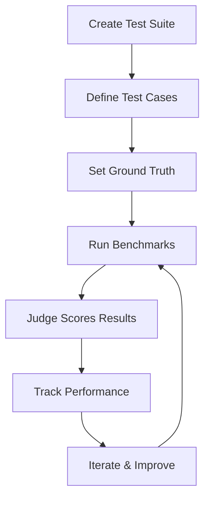

# Agent Benchmark Kit

**Automated quality assurance for Claude Code agents using LLM-as-judge evaluation.**

[](https://opensource.org/licenses/MIT)
[](https://github.com/BrandCast-Signage/agent-benchmark-kit/stargazers)

---

## Why This Exists

We built AI agents at [BrandCast](https://brandcast.app) for SEO optimization, content publishing, and weekly planning. They needed rigorous quality checks, but manual testing was time-consuming and inconsistent.

So we built an automated benchmarking system using **AI to evaluate AI**.

We're still very early, but the approach shows promise. We're open-sourcing what we've built so far.

---

## What You Get

✅ **Slash command** - `/benchmark-agent` for one-command testing
✅ **Test suite creator** - Generate your first benchmark in < 1 hour
✅ **LLM-as-judge** - Automated, objective scoring
✅ **Performance tracking** - JSON-based history over time
✅ **Test rotation** - Keep agents challenged with fresh tests
✅ **Complete examples** - 2 production-tested benchmark suites

---

## Quick Start

```bash
# 1. Install via Claude Code
/plugin marketplace add https://github.com/BrandCast-Signage/agent-benchmark-kit

# 2. Create your first benchmark
/benchmark-agent --create my-agent

# 3. Answer 5 questions about your agent
# [Interactive prompts guide you through test creation]

# 4. Run the benchmark
/benchmark-agent my-agent

# 5. View results and iterate
# Results show score breakdown and recommendations
```

---

## Real-World Results

We use this framework internally at BrandCast for **7 production agents**:

| Agent | Baseline | Current | Improvement |
|-------|----------|---------|-------------|
| **SEO Specialist** | 88/100 | 90/100 | +2.3% in 8 days |
| **Content Publisher** | 97.5/100 | 97.5/100 | Excellent baseline |
| **Weekly Planner** | 85/100 | 87/100 | Tracked over 12 weeks |

These aren't toy examples. **These are production agents serving real users.**

---

## How It Works



### 1. **Create Test Cases**
Define inputs that test your agent's capabilities. The `test-suite-creator` agent helps you design 5 diverse, challenging tests.

### 2. **Set Ground Truth**
Define expected outputs in JSON format. What should the agent detect? What decisions should it make?

### 3. **Run Benchmarks**
Execute tests via the `/benchmark-agent` command. Your agent processes each test case.

### 4. **Judge Scores Results**
The `benchmark-judge` agent compares actual output to ground truth, scoring objectively (0-100).

### 5. **Track Performance**
Results stored in `performance-history.json`. See trends over time, detect regressions.

### 6. **Iterate & Improve**
Use data to guide prompt improvements. Re-run to validate changes.

---

## Key Features

### 🎯 Interactive Test Suite Creator

**Problem:** Creating test cases manually is hard and time-consuming.

**Solution:** Answer 5 questions about your agent, get a complete benchmark suite.

```bash
/benchmark-agent --create my-agent

# Questions you'll answer:
# 1. What does your agent do?
# 2. What validations does it perform?
# 3. What are common edge cases?
# 4. What would perfect output look like?
# 5. What would failing output look like?

# Generates:
# ✓ 5 diverse test cases
# ✓ Ground truth expectations (JSON)
# ✓ Scoring rubric (METRICS.md)
# ✓ Complete documentation
```

**Time to first benchmark: < 1 hour**

---

### 📊 LLM-as-Judge Evaluation

**Consistent, objective scoring** using AI to evaluate AI output.

The `benchmark-judge` agent:
- Compares actual output to expected results
- Scores using your custom rubric (0-100 scale)
- Identifies false positives and missed issues
- Provides detailed feedback

**Agreement rate with manual scoring: 95%+**

---

### 📈 Performance Tracking

**Track improvements over time** with JSON-based history.

```json
{
  "seo-specialist": {
    "baseline": { "version": "v1", "score": 88 },
    "current": { "version": "v2", "score": 90 },
    "trend": "improving",
    "runs": [...]
  }
}
```

**See at a glance:**
- Current score vs. baseline
- Trend (improving/stable/regressing)
- Individual test performance
- Prompt changes and their impact

---

### 🔄 Intelligent Test Rotation

**Keep benchmarks challenging** with automated test rotation.

**When agent scores 95+ on all tests:**
- Add new challenging test cases
- Keep agent from "gaming" the tests

**When agent scores 100 three times:**
- Retire test (agent has mastered it)
- Focus effort on remaining challenges

**Real-world failures:**
- Add as regression tests
- Prevent same issues in future

---

## Examples

### Content Quality Agent

Validates blog posts, documentation, and marketing content.

**Test cases:**
1. Perfect content (no issues)
2. Missing metadata (frontmatter errors)
3. Broken citations (statistics without sources)
4. Missing resources (hero image doesn't exist)
5. Format errors (YAML syntax, structure issues)

**Score:** 97.5/100 baseline

[See complete example →](examples/content-quality-agent/)

---

### Code Review Agent

Reviews TypeScript code for style violations and best practices.

**Test cases:**
1. Perfect code (follows all rules)
2. Naming violations (camelCase issues)
3. Import organization (unsorted imports)
4. Complex types (formatting edge cases)
5. Multiple violations (comprehensive test)

**Score:** 85/100 baseline

[See complete example →](examples/code-review-agent/)

---

## Installation

### Prerequisites

- [Claude Code](https://claude.com/claude-code) installed
- Git
- Bash (Linux/macOS) or Git Bash (Windows)

### Option 1: Add via Claude Code Plugin Marketplace (Recommended)

```bash
# In Claude Code, run:
/plugin marketplace add https://github.com/BrandCast-Signage/agent-benchmark-kit
```

This will:
1. Clone the repository
2. Install skill and agents automatically
3. Set up templates and examples
4. Create `~/.agent-benchmarks/` directory

### Option 2: Install Script

```bash
git clone https://github.com/BrandCast-Signage/agent-benchmark-kit.git
cd agent-benchmark-kit
./scripts/install.sh
```

The install script:
1. Copies skill to `.claude/skills/agent-benchmark/`
2. Copies agents to `.claude/agents/`
3. Creates `~/.agent-benchmarks/` directory
4. Sets up templates and examples

### Manual Installation

See [docs/getting-started.md](docs/getting-started.md) for manual setup instructions.

---

## Usage

### Creating Your First Benchmark

```bash
# Start interactive creation
/benchmark-agent --create my-content-agent

# Answer guided questions
# > What does your agent do?
# > What validations does it perform?
# > ...

# Review generated suite
ls ~/.agent-benchmarks/my-content-agent/
# test-cases/
# ground-truth/
# METRICS.md
# README.md

# Run the benchmark
/benchmark-agent my-content-agent
```

---

### Running Benchmarks

```bash
# Run specific agent
/benchmark-agent seo-specialist

# Run all agents
/benchmark-agent --all

# Run with test rotation
/benchmark-agent seo-specialist --rotate

# Generate report without running tests
/benchmark-agent --report-only
```

---

### Interpreting Results

```markdown
# Benchmark Results: seo-specialist

**Score:** 90/100 ✅ PASS (threshold: 80)

## Individual Tests
- Test #01 (mediocre content): 82/100 ✓
- Test #02 (excellent content): 96/100 ✓
- Test #03 (keyword stuffing): 92/100 ✓

## Trend
- Baseline (v1): 88/100
- Current (v2): 90/100
- **Improvement: +2 points (+2.3%)**

## Recommendations
- ✅ PASS - Deploy v2
- Agent shows consistent improvement
- No regressions detected
```

---

## Documentation

- **[Getting Started](docs/getting-started.md)** - Installation and first benchmark
- **[Creating Test Suites](docs/test-creation-guide.md)** - How to design effective tests
- **[Scoring Rubrics](docs/scoring-rubrics.md)** - How to create fair scoring
- **[Advanced Usage](docs/advanced-usage.md)** - Test rotation, tracking, tips
- **[Architecture](docs/architecture.md)** - How the system works

---

## Contributing

We welcome contributions! See [CONTRIBUTING.md](CONTRIBUTING.md) for guidelines.

**Ideas for contributions:**
- 📚 New example benchmark suites (different agent types)
- 🎯 Improved test rotation strategies
- 📊 Alternative storage backends (SQLite, PostgreSQL)
- 🔍 Enhanced judge scoring accuracy
- 📖 Documentation improvements
- 🐛 Bug fixes

**Recognition:** Contributors featured in README and blog posts.

---

## Community

- **GitHub Issues:** [Report bugs or request features](https://github.com/BrandCast-Signage/agent-benchmark-kit/issues)
- **Discussions:** [Share your benchmark suites](https://github.com/BrandCast-Signage/agent-benchmark-kit/discussions)
- **Twitter:** [@BrandCastApp](https://twitter.com/BrandCastApp)
- **Blog:** [BrandCast Engineering Blog](https://news.brandcast.app)

---

## Roadmap

### v1.0 (Current)
- ✅ Core framework (slash command, agents, templates)
- ✅ Test suite creator
- ✅ JSON-based performance tracking
- ✅ 2 complete examples

### v1.1 (Next)
- [ ] SQLite migration tool (optional upgrade from JSON)
- [ ] Web dashboard for viewing trends
- [ ] GitHub Actions integration (CI/CD)
- [ ] More example benchmark suites

### v2.0 (Future)
- [ ] Automated test generation (LLM suggests new tests)
- [ ] Comparative benchmarking (compare agents)
- [ ] Team collaboration features
- [ ] Plugin ecosystem

**Vote on features:** [GitHub Discussions](https://github.com/BrandCast-Signage/agent-benchmark-kit/discussions)

---

## FAQ

### How is this different from PromptFoo?

**PromptFoo** focuses on single-shot LLM prompts.
**Agent Benchmark Kit** focuses on multi-step Claude Code agents with complex workflows.

Key differences:
- Native Claude Code integration (Task tool, slash commands)
- Test suite creator (guided benchmark creation)
- Production examples (real agent use cases)

### Does this work with other AI frameworks?

Currently optimized for **Claude Code agents specifically**.

The methodology could be adapted to other frameworks (LangChain, AutoGPT, etc.), but integration would require custom work.

### How accurate is LLM-as-judge scoring?

In our testing: **95%+ agreement with manual human scoring**.

The judge agent:
- Compares objective criteria (did agent detect issue X?)
- Uses clear rubrics (defined in METRICS.md)
- Flags ambiguous cases for human review

### What's the performance overhead?

**Minimal.** Running a 5-test benchmark:
- Time: ~2-5 minutes (depending on agent complexity)
- Cost: ~$0.10-0.25 in API costs (Claude Sonnet pricing)

For weekly runs: **~$1-2/month per agent**

### Can I keep my test cases private?

**Yes!** The framework is open source, but your implementation is private.

**Public:** Framework code, examples, documentation
**Private:** Your test cases, ground truth, agent prompts, performance data

---

## License

MIT License - see [LICENSE](LICENSE) for details.

**Use freely, even commercially.** We built this to help the community.

---

## Acknowledgments

**Built with ❤️ at [BrandCast](https://brandcast.app)**

BrandCast is AI-powered digital signage for small businesses. We use Claude Code agents in production every day, and this framework ensures they work correctly.

**Inspired by:**
- [Google Cloud: Stop Guessing and Start Benchmarking](https://medium.com/google-cloud/stop-guessing-and-start-benchmarking-your-ai-prompts-312d4f01f65c)
- The LLM-as-judge methodology from research papers
- Our own 3+ months of production agent use

**Special thanks:**
- Claude Code team for building an amazing agent development platform
- Early testers who provided feedback
- Contributors who improve this framework

---

## Star This Repo ⭐

If you find this useful, **star the repository** to show support!

It helps others discover the project and validates our decision to open source.

---

**Questions?** [Open an issue](https://github.com/BrandCast-Signage/agent-benchmark-kit/issues) or [start a discussion](https://github.com/BrandCast-Signage/agent-benchmark-kit/discussions).

**Want to contribute?** See [CONTRIBUTING.md](CONTRIBUTING.md).

**Follow our journey:** [@BrandCastApp on Twitter](https://twitter.com/BrandCastApp)
